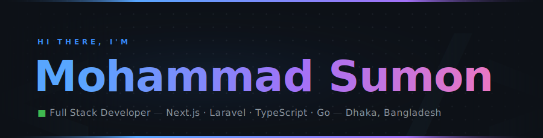

<div align="center">

</div>

<br/>

<div align="center">

[](https://www.linkedin.com/in/mohammadsumon)
[](mailto:sumonsbgc@gmail.com)
[](https://wa.me/8801516120343)
[](https://github.com/sumonsbgc)
[](https://github.com/sumonsbgc)

</div>

<br/>

---

## 🧑‍💻 &nbsp;About Me

```typescript
const sumon = {
  name:        "Mohammad Sumon",
  role:        "Full Stack Developer",
  experience:  "8+ years",
  location:    "Dhaka, Bangladesh 🇧🇩",

  currentWork: [
    "Metro Extended Stay — Hotel & Property Management Systems",
    "Space Cats — Full Stack Web Applications",
  ],

  stack: {
    frontend:  ["Next.js", "React", "TypeScript", "TailwindCSS", "Redux Toolkit"],
    backend:   ["Laravel", "PHP", "Node.js", "Express", "Golang"],
    database:  ["MySQL", "PostgreSQL"],
    cloud:     ["AWS S3", "AWS Lambda", "EC2"],
    mobile:    ["React Native"],
  },

  contact: {
    email:     "sumonsbgc@gmail.com",
    whatsapp:  "+880 1516 120 343",
    phone:     "+880 1307 129386",
    linkedin:  "linkedin.com/in/mohammadsumon",
  },

  learning:   ["Golang", "Rust", "Distributed Systems"],
  passions:   ["Clean Architecture", "Type Safety", "Scalable APIs", "DevOps"],

  funFact:    "I debug with console.log and I'm not ashamed 😄",
};
```

---

## 🚀 &nbsp;Current Projects

<table>
<tr>
<td width="50%" valign="top">
<h4>🏨 &nbsp;Metro Hospitality Stack</h4>
<p>Full hotel management ecosystem — reservations, front desk, smart access via RemoteLock API, workforce tools, and dynamic pricing integrated with Guesty API.</p>


</td>
<td width="50%" valign="top">
<h4>💰 &nbsp;Dynamic Pricing Engine</h4>
<p>PriceLabs-style room rate optimization tool — analyzes occupancy, demand signals, and competitor rates to auto-adjust pricing across properties in real time.</p>


</td>
</tr>
<tr>
<td width="50%" valign="top">
<h4>🔐 &nbsp;Smart Access System</h4>
<p>Digital key management via RemoteLock API — guests receive mobile keys and access rooms without physical key handoffs, integrated into the full hospitality stack.</p>


</td>
<td width="50%" valign="top">
<h4>👥 &nbsp;Workforce Management App</h4>
<p>In-house platform for staff task tracking, shift scheduling, and HR workflows across multi-property hotel operations — replacing manual coordination.</p>


</td>
</tr>
</table>

---

## 🛠 &nbsp;Tech Stack

```
// Frontend
```


```
// Backend
```


```
// Database & Cloud
```


```
// Tools
```


```
// Learning
```


---

## 📊 &nbsp;GitHub Stats

<div align="center">


&nbsp;


</div>

<div align="center">

[](https://git.io/streak-stats)

</div>

<div align="center">

[](https://github.com/ashutosh00710/github-readme-activity-graph)

</div>

---

## 🏆 &nbsp;Trophies

<div align="center">

[](https://github.com/ryo-ma/github-profile-trophy)

</div>

---

## 💼 &nbsp;Career

| &nbsp; | Company | Role | Period | Location |
|:---:|---|---|---|---|
| 🏨 | **Metro Extended Stay** | Full Stack Developer | Jan 2023 – Present | Phoenix, AZ · Remote |
| 🐱 | **Space Cats** | Full Stack Developer | Nov 2022 – Present | Arizona · Remote |
| 🚗 | **Dropme** | Software Developer | Aug 2021 – Dec 2022 | Chattogram, BD |
| 💻 | **Encoder IT Solution** | Full Stack Developer | Jan 2021 – Dec 2022 | Chittagong, BD |
| 🌐 | **Cloudintaweb** | Web Developer | Sep 2017 – Jan 2019 | London, UK · Remote |

---

## 🔗 &nbsp;Integrations & APIs

<div align="center">


</div>

---

<div align="center">


**Let's build something great together**

[](https://www.linkedin.com/in/mohammadsumon)
[](mailto:sumonsbgc@gmail.com)
[](https://wa.me/8801516120343)
[](tel:+8801307129386)

<br/>


</div>
