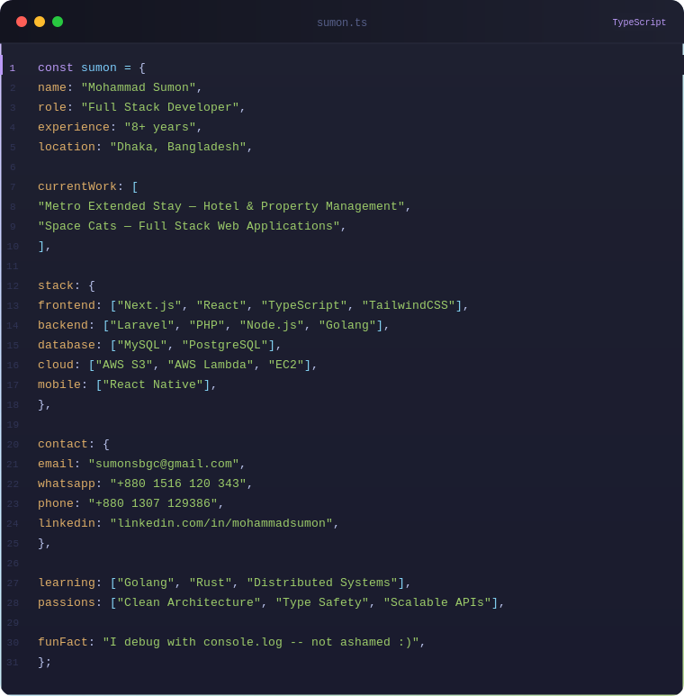

 

---

## 🧑‍💻 About Me

  

---

## 🚀 What I'm Working On

<table>
  <tr>
    <td width="50%" valign="top">
      <h3>🏨 Metro Hospitality Stack</h3>
      
Full hotel management ecosystem — reservations, front desk, smart access (RemoteLock API), workforce management, and dynamic pricing tools integrated with Guesty API.

      

        
        
        
        
      

    </td>
    <td width="50%" valign="top">
      <h3>💰 Dynamic Pricing Engine</h3>
      
PriceLabs-style room rate optimization tool that analyzes occupancy, demand signals, and competitor rates to automatically adjust pricing across properties.

      

        
        
        
      

    </td>
  </tr>
  <tr>
    <td width="50%" valign="top">
      <h3>🔐 Smart Access System</h3>
      
Digital key management system allowing guests to access rooms via mobile using RemoteLock API integration — replacing physical key workflows entirely.

      

        
        
      

    </td>
    <td width="50%" valign="top">
      <h3>👥 Workforce Management App</h3>
      
In-house platform for staff task tracking, shift scheduling, and HR workflows across multi-property hotel operations.

      

        
        
        
      

    </td>
  </tr>
</table>

---

## 🛠 Tech Stack

### Frontend

### Backend

### Database & Cloud

### Tools & Others

### Currently Learning

---

## 📊 GitHub Stats

&nbsp;

---

## 🏆 GitHub Trophies

---

## 💼 Career Highlights

| 🏢 Company | 💡 Role | 📅 Period | 🌍 Location |
|---|---|---|---|
| Metro Extended Stay | Full Stack Developer | Jan 2023 – Present | Phoenix, AZ (Remote) |
| Space Cats | Full Stack Developer | Nov 2022 – Present | Arizona, USA (Remote) |
| Dropme | Software Developer | Aug 2021 – Dec 2022 | Chattogram, BD |
| Encoder IT Solution | Full Stack Developer | Jan 2021 – Dec 2022 | Chittagong, BD |
| Cloudintaweb | Web Developer | Sep 2017 – Jan 2019 | London, UK (Remote) |

---

## 🔗 Notable Integrations & APIs

---

### 💬 Let's connect and build something great together!

